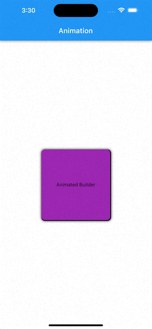

# Animation in flutter

### Flutter animation in depth

In this project, in depth and advanced animation will be implemented

## Features

- Animation

<!--   -->

## Showcase
### Animated Builder

<table>
  <tr>
    <td></td>
  </tr>
 </table>

 

## Stacks

- Dart
- Flutter

 

## Topics

- Animation
- Animated builder
- TickerProviderStateMixin
- AnimationController
- Tween
- AnimatedBuilder
- Transform
- Matrix4.identity()

 

## Q/A
N/A

## Topics to have a look
- BLoC
- BLoC debugger info
- BlocBuilder
- BlocListener
- BlocConsumer
- HydratedBloc

## Packages and dependencies
N/A

## Issues
N/A